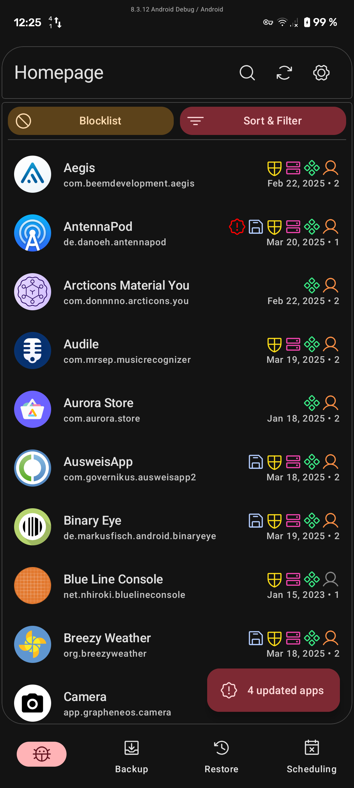
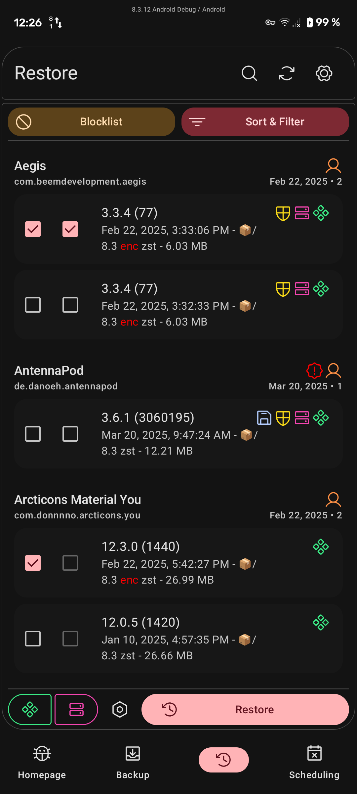
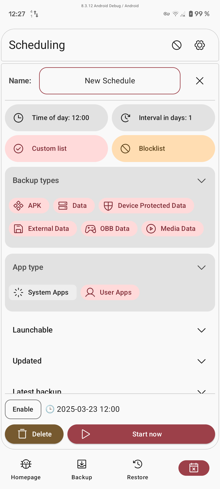

<h1 align="center">
  
   
  Neo Backup
</h1>

<strong>Android's modern backup solution for everyone!</strong>

Neo Backup (formerly OAndBackupX) is a fork of the famous OAndBackup with the aim to bring OAndBackup to 202X and part of Neo Applications suite. For now the app is already fully rewritten, coming up would be making it robust and adding some lengthily planned features which could ease the backup/restore workflow with any device. Therefore all types of contribution are always welcome.

## Features :abacus:

* It requires root and allows you to backup individual apps and their data.
* Both backup and restore of individual programs one at a time and batch backup and restore of multiple programs are supported.
* Restoring system apps should be possible without requiring a reboot afterwards.
* Backups can be scheduled with no limit on the number of individual schedules and there is the possibility of creating custom lists from the list of installed apps.
* To find more info just visit the project's [FAQ](FAQ.md).

### Upcoming plans :eyes: 

We also have a Kanban board on Taiga where you can see our future plans. Feel free to contact us if you'd like to contribute to any of the planned changes.

## Screenshots :framed_picture:

 
 
 
 

## Recommendation

A combination with your favourite sync solution (e.g. Syncthing, Nextcloud...)  keeping an encrypted copy of your apps and their data on your server or "stable" device could bring a lot of benefits and save you a lot of work while changing ROMs or just cleaning your mobile device.

## Encryption

If enabled the data backup will be encrypted with AES256 based on a password you can set in the settings, which you'll have to use when you want to restore the data. This way you can store your backups more securely, worrying less about their readability.

## Compatibility

Version 5.0.0 uses new encryption, new databases, fixes most of reported bugs in 4.0.0 and boost the performance to something near the 3.2.0's. With that said, it's incompatible with the older versions.

Version 4.0.0 marks a full overhaul of the app structure and thus breaks compatibility with previous versions.

Till the version 0.9.3 there's been no structural change in how the app handles backup/restore. So you could use that version to restore the old backups, then move to the newest version and renew your backups so that they'll stay compatible as long as the logic of the app doesn't radically change.

## Community :speech_balloon:

You can join either our [Telegram](https://t.me/neo_backup) or [Matrix](https://matrix.to/#/#neo-backup:matrix.org) groups to make suggestions, ask questions, receive news, install test builds, or just chat.

Our **[Code of Conduct](COC.md)** applies to the communication in the community same as for all contributors.

## Translation :left_speech_bubble: 

Contribute your translations to Neo Backup on [Hosted Weblate](https://hosted.weblate.org/engage/neo-backup/).   Adding new languages is always accepted and supported.

Before being hosted at Weblate, translations were done manually by those great people:

[Kostas Giapis](https://github.com/tsiflimagas), [Urnyx05](https://github.com/Urnyx05), [Atrate](https://github.com/Atrate), [Tuchit](https://github.com/tuchit), [Linsui](https://github.com/linsui), [scrubjay55](https://github.com/scrubjay55), [Antyradek](https://github.com/Antyradek), [Ninja1998](https://github.com/NiNjA1998), [elea11](https://github.com/elea11).

## Donations

I, myself acknowledge the role of the donations to motivate the work on FOSS projects, but in the state of how dynamic everything around my FOSS-contributions is, I would prefer to not take donations for now (the same answer as the last years). Nevertheless this project wouldn't have the accessibility it has without translations, which you the community drive and for which Weblate provides a platform. That's why I would suggest you to consider [donating to Weblate](https://weblate.org/donate).

## Special Thanks :heart:

[Jens Stein](https://github.com/jensstein) for his unbelievably valuable work on OAndBackup.

[Harald Gutsche](https://github.com/hg42), [Nils](https://github.com/Tiefkuehlpizze), [Martin](https://github.com/Smojo) and [DL](https://github.com/dl200010) for their long and active contribution to the project.

[Oliver Pepperell](https://github.com/opepp) for his contribution to the new anniversary design.

[Helena Zheng](https://helenazhang.com/) & [Tobias Fried](https://tobiasfried.com/) for the great [Phosphor Icons](https://phosphoricons.com/), we gladly use.

Thanks to [Tuta](https://tuta.com) for the premium account.

## Contributors :handshake:

## Licenses 

Licensed under the [GNU's Affero GPL v3](LICENSE.md).

App's icon is based on an Icon made by [Catalin Fertu](https://www.flaticon.com/authors/catalin-fertu) from [www.flaticon.com](https://www.flaticon.com)

All new icons in 7.0.0 based on CC0 icons found on [SVG Repo](https://www.svgrepo.com). A huge thanks for the project's maintainers.

All new icons in 8.0.0 based on [Phosphor Icons](https://phosphoricons.com/). A huge thanks for the project's maintainers.

Copyright © 2025 [Antonios Hazim](https://github.com/machiav3lli) and [contributors](https://github.com/NeoApplications/Neo-Backup/graphs/contributors).

<a href="https://www.star-history.com/#NeoApplications/Neo-Backup&Date">
 <picture>
   <source media="(prefers-color-scheme: dark)" srcset="https://api.star-history.com/svg?repos=NeoApplications/Neo-Backup&type=Date&theme=dark" />
   <source media="(prefers-color-scheme: light)" srcset="https://api.star-history.com/svg?repos=NeoApplications/Neo-Backup&type=Date" />
   
 </picture>
</a>
